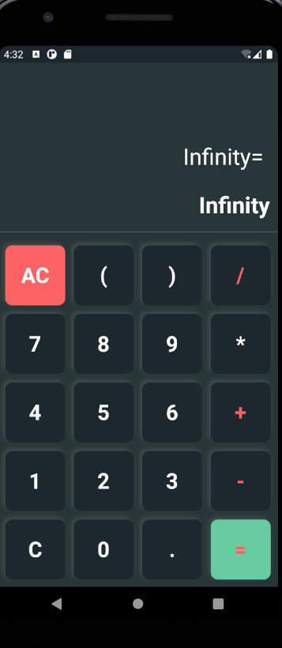

# flutter_calculator

## About

This is a simple calculator that supports the 4 basic mathematical operations (addition, subtraction, multiplication, and division) build with flutter.

## Screenshots
#### Sample Usage

#### Division by zero supported

